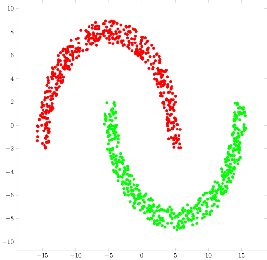
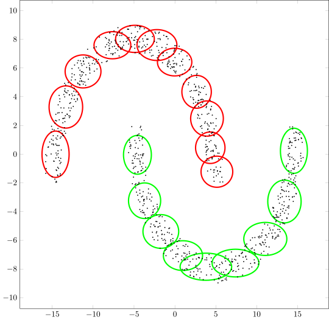
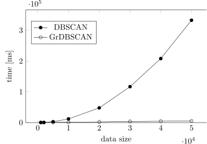

# GrDBSCAN: A Granular Density-Based Clustering Algorithm

[](https://doi.org/10.34768/amcs-2023-0022)
[](https://doi.org/10.34768/amcs-2023-0022)
[](https://en.cppreference.com/w/cpp/23)

Reference implementation of **GrDBSCAN**, a novel density-based clustering algorithm introduced in the accompanying publication in the *International Journal of Applied Mathematics and Computer Science*.

## Publication

**D. Suchy, K. Simiński**

*GrDBSCAN: A Granular Density-Based Clustering Algorithm*

*International Journal of Applied Mathematics and Computer Science*, **33**(2), 2023

DOI: https://doi.org/10.34768/amcs-2023-0022

## Directory contents

This directory contains the reference implementation used in the experiments reported in the accompanying publication.

- granular-dbscan.h — public API
- granular-dbscan.cpp — reference implementation

## Highlights

- Reference implementation accompanying a peer-reviewed publication
- Novel granular formulation of density-based clustering
- Linear complexity under the proposed formulation
- Support for hyperellipsoidal neighbourhoods
- Designed for efficient clustering in higher-dimensional spaces
- Compatible with fuzzy descriptors

## Background
GrDBSCAN is a density-based clustering algorithm with linear complexity under a granular formulation, supporting hyperellipsoidal neighbourhoods and remaining efficient in higher-dimensional spaces. 

The algorithm is proposed as an alternative to the classic quadratic-time DBSCAN approach.

## Comparison

Clustering results for the **"Two Crescents"** dataset.

<table align="center">
    <tr>
        <td align="center"><b>DBSCAN</b></td>
        <td align="center"><b>GrDBSCAN</b></td>
    </tr>
    <tr>
        <td align="center">
            
        </td>
        <td align="center">
            
        </td>
    </tr>
</table>

## Performance

Execution time comparison with respect to the number of data items in the **"Two Crescents"** dataset.

<p align="center">
    
</p>

## Citation
If you use this implementation in your research, please cite the accompanying publication.

```bibtex
@ARTICLE{Suchy2023GrDBSCAN,
    title   = {GrDBSCAN: A Granular Density–Based Clustering Algorithm},
    author  = {Suchy, Dawid and Siminski, Krzysztof},
    journal = {International Journal of Applied Mathematics and Computer Science},
    volume  = {33},
    number  = {2},
    pages   = {297--312},
    year    = {2023},
    doi     = {10.34768/amcs-2023-0022}
}   
```